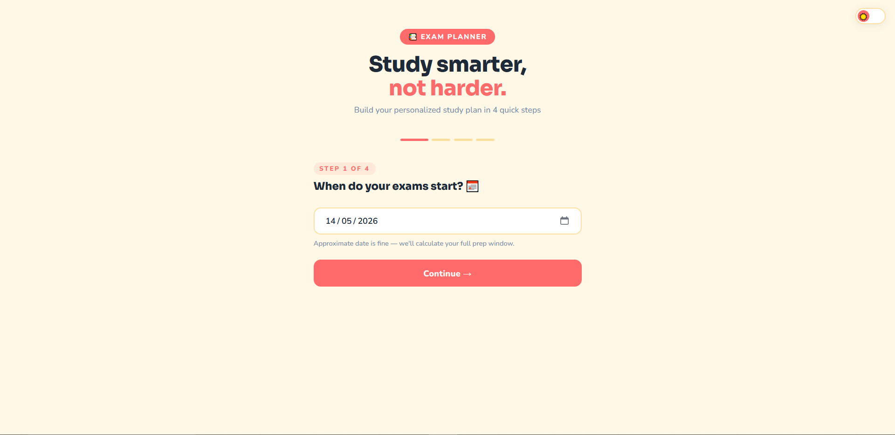
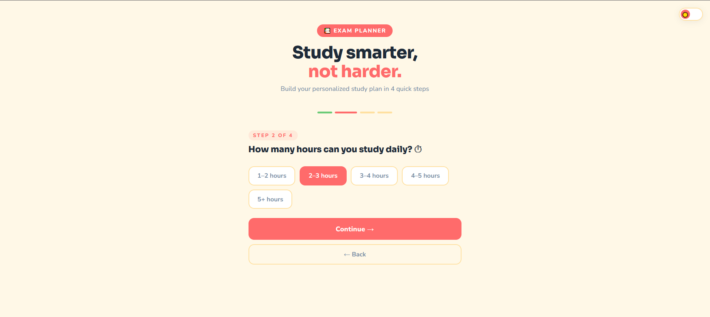
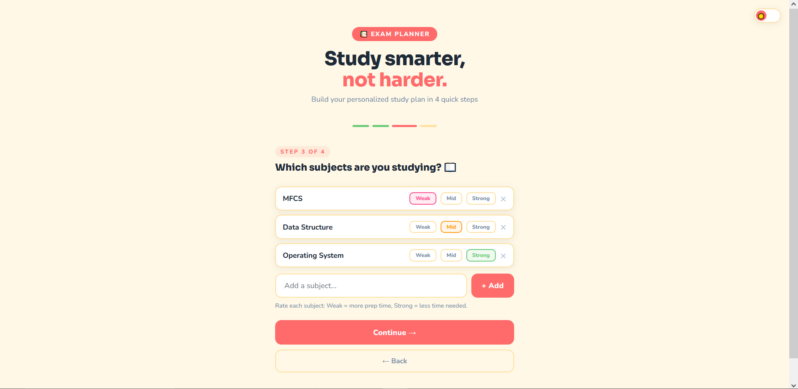
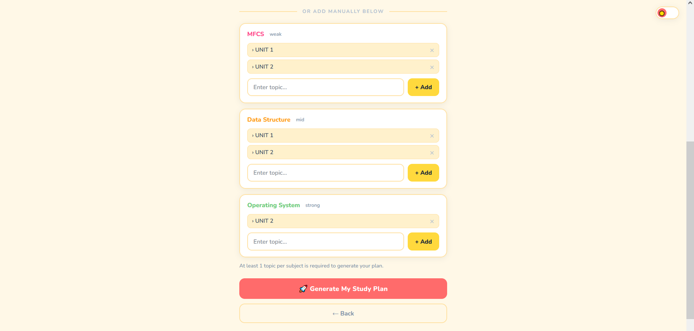

# 📅 Exam Planner

A personalized study schedule generator that helps students plan their exam preparation based on subjects, difficulty level, and available study time.

---

## 🚀 Live Demo

👉 https://praful77jha.github.io/Exam-Planner/
---

## 🧑‍💻 About

Exam Planner is a smart web app that helps students organize their exam prep by generating a day-by-day study roadmap. Students can add subjects, set difficulty levels, and input available study hours — the app handles the rest.

---

## ✨ Features

- Add subjects with custom difficulty levels
- Input available daily study time
- Auto-generates a personalized study + revision roadmap
- Tracks daily study progress
- Local progress saving for seamless day-to-day planning
- Fully responsive design

---

## 🛠️ Tech Stack

- HTML5
- CSS3
- JavaScript (Vanilla)

---

## 📸 Preview

### 🏠 Home Screen

### 📚 Subject Planner — How It Works

The subject planner walks you through 4 steps to build your personalized study roadmap.

### Step 1 — Choose Your Exam Date
Pick the date your exam starts. The planner uses this to calculate how many days you have left and builds your schedule around it.

### Step 2 — Set Your Daily Study Hours
Enter how many hours per day you can realistically study. This helps the planner distribute subjects evenly across your available time.

### Step 3 — Add Your Subjects
Add all the subjects you're studying. For each subject, mark it as **Weak**, **Mid**, or **Strong** so the planner knows how much time to allocate to each.

### Step 4 — Add Topics for Each Subject
Add topics manually for each subject. *(The AI Syllabus Scanner is currently unavailable — see Known Issues below.)*

### 📈 Progress Tracker
Click on **Generate My Plan** and your personalized day-by-day study tracker is ready. It shows your overall progress, today's task, and a full schedule broken down by subject and date. Mark topics as complete by clicking the checkbox — the tracker updates your progress in real time.

---

## 🐛 Known Issues

- **AI Syllabus Scanner** — The AI topic extraction feature is currently not working as expected. The Gemini API is returning empty responses for image inputs. The `/api/claude` serverless function is deployed and receiving requests successfully (HTTP 200), but Gemini is returning a `429` (rate limit) or empty text response. This is being investigated. As a workaround, topics can be added manually.

---

## 🔮 Future Plans

- **User Login & Cloud Storage** — Planning to add user authentication so progress and study plans can be saved to the cloud instead of just locally. This will allow students to access their planner from any device.
- Fix AI Syllabus Scanner and make Gemini API integration stable
- Add notifications/reminders for daily study goals
- Export study plan as PDF

---

## 📚 What I Learned

- Building practical productivity tools with vanilla JS
- Working with `localStorage` for persistent data
- Dynamic DOM manipulation
- Designing intuitive user interfaces

---

## 🔗 Links

- GitHub: https://github.com/Praful77Jha
---

Built to solve a real problem — staying organized before exams 🚀
